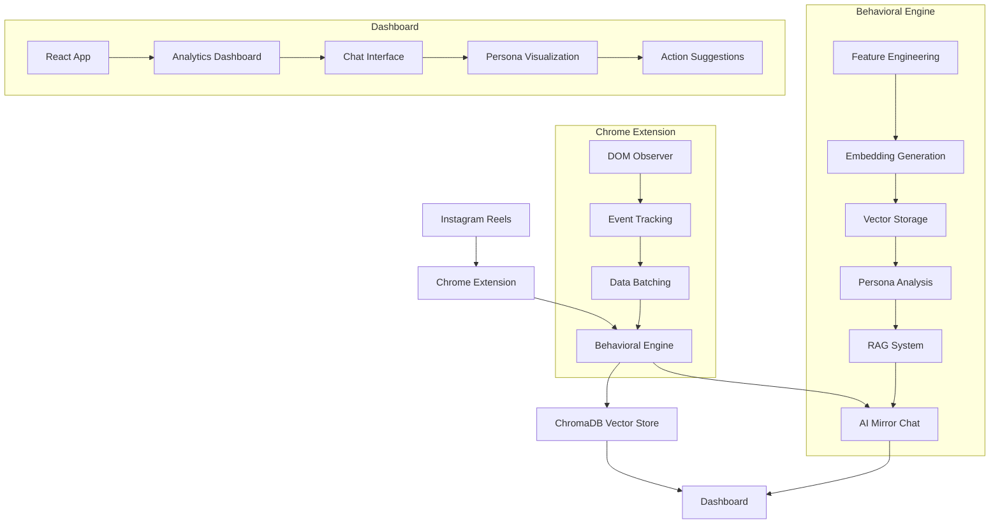
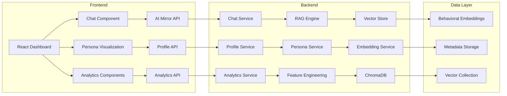

# AIMirror System Architecture Diagram

## Clean IEEE-Style Architecture Figure

### Main System Flow Diagram



### Component Interaction Diagram



## LaTeX Figure Code

```latex
\begin{figure}[htbp]
\centering
\includegraphics[width=0.48\textwidth]{aimirror_architecture.pdf}
\caption{AIMirror system architecture showing the complete pipeline from behavioral extraction through AI-powered insights to user-facing dashboard. The system integrates client-side behavioral monitoring, vector-based memory storage, and adaptive reinforcement learning for personalized user guidance.}
\label{fig:aimirror_architecture}
\end{figure}
```

## How to Reference in Paper

### In System Architecture Section:
```latex
Figure~\ref{fig:aimirror_architecture} illustrates the complete AIMirror system architecture. The system follows a modular pipeline from behavioral extraction to user-facing insights.
```

### In Introduction:
```latex
As shown in Figure~\ref{fig:aimirror_architecture}, our approach integrates behavioral extraction, vector-based memory, and adaptive personalization to create a comprehensive behavioral digital twin.
```

### In Related Work:
```latex
Unlike traditional recommender systems that focus on platform optimization, our architecture (Figure~\ref{fig:aimirror_architecture}) prioritizes user-centric behavioral analysis and self-alignment.
```

## Export Instructions

### Using Mermaid Live Editor:
1. Go to https://mermaid.live
2. Copy the main system flow diagram code
3. Set theme to "default" or "forest"
4. Export as PNG with white background
5. Save as `aimirror_architecture.pdf`

### Using Online Tools:
1. https://mermaid.ink - Clean exports
2. https://diagrams.net - Professional styling
3. https://draw.io - Customizable layouts

## Design Specifications

### Clean Academic Style:
- **Background:** White
- **Colors:** Minimal (black, gray, blue accents)
- **Fonts:** Sans-serif (Arial, Helvetica)
- **Lines:** Clean, consistent width
- **Boxes:** Rounded corners, subtle borders

### Professional Layout:
- **Hierarchy:** Clear top-to-bottom flow
- **Spacing:** Consistent margins
- **Labels:** Clear, readable text
- **Arrows:** Directional indicators
- **Groups:** Logical component clustering

## IEEE Figure Requirements

### Technical Specifications:
- **Format:** PDF or PNG
- **Resolution:** 300+ DPI
- **Width:** 3.5 inches (single column) or 7 inches (double column)
- **File Size:** Under 1MB
- **Color:** Grayscale acceptable

### Content Guidelines:
- **Clear Labels:** All components labeled
- **Consistent Styling:** Uniform appearance
- **Professional Appearance:** No decorative elements
- **Readable Text:** Minimum 8pt font size

## Integration with Paper

### Figure Placement:
```latex
% Place after System Architecture section introduction
\section{System Architecture}
\label{sec:architecture}

Figure~\ref{fig:aimirror_architecture} illustrates the complete AIMirror system architecture...
```

### Cross-References:
```latex
% Reference in multiple sections
As described in Section~\ref{sec:architecture} and shown in Figure~\ref{fig:aimirror_architecture}...
```

### Caption Requirements:
- **Descriptive:** Explain what the figure shows
- **Complete:** Standalone understanding
- **Concise:** Under 15 words preferred
- **Numbered:** Sequential figure numbering
