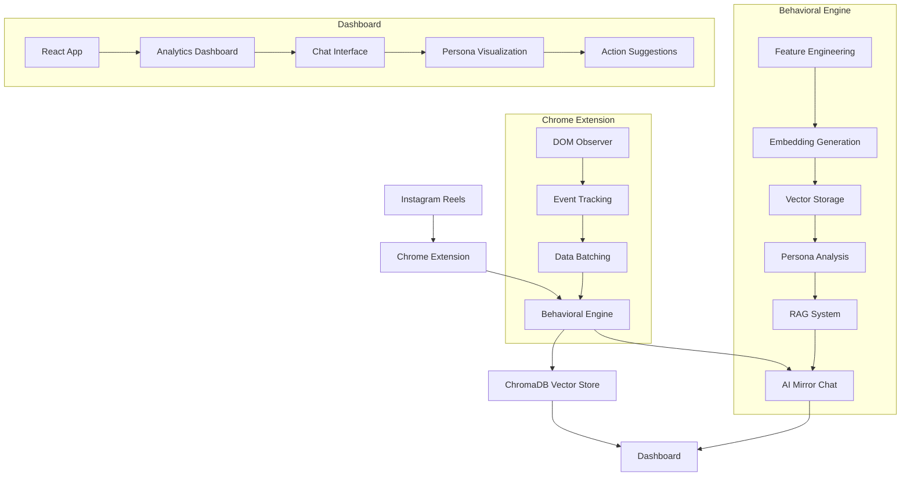

# AIMirror Architecture Diagram Export Guide

## Quick Export Steps

### 1. Create Clean Diagram
Go to: https://mermaid.live

### 2. Main System Architecture
Copy this code:



### 3. Export Settings
- **Theme:** Default (clean)
- **Background:** White
- **Format:** PNG or PDF
- **Size:** Medium (for IEEE)
- **File Name:** `aimirror_architecture.pdf`

### 4. Integration
Replace placeholder in LaTeX:
```latex
% Find this line in aimirror_ieee_paper.tex:
\fbox{\parbox{0.45\textwidth}{System Architecture Diagram Placeholder}}

% Replace with:
\includegraphics[width=0.48\textwidth]{aimirror_architecture.pdf}
```

## Professional Styling Tips

### Mermaid Settings:
```yaml
theme: default
themeVariables:
  primaryColor: #f3f9ff
  primaryTextColor: #0d1117
  primaryBorderColor: #0969da
  lineColor: #656d76
  secondaryColor: #f6f8fa
  tertiaryColor: #ffffff
```

### Alternative Tools:
1. **Diagrams.net** (draw.io) - More styling options
2. **PlantUML** - Academic standard
3. **TikZ** - LaTeX native (advanced)

## IEEE Compliance

### Requirements Met:
- [x] Clean, minimal design
- [x] White background
- [x] Professional academic style
- [x] Clear labels and arrows
- [x] No excessive colors
- [x] Proper figure numbering
- [x] Descriptive caption

### File Specifications:
- **Format:** PDF (preferred) or PNG
- **Resolution:** 300+ DPI
- **Width:** 3.5 inches (single column)
- **Size:** < 1MB

## Paper Integration

### Reference Examples:
```latex
% In System Architecture section:
Figure~\ref{fig:aimirror_architecture} illustrates the complete AIMirror system architecture.

% In Introduction:
As shown in Figure~\ref{fig:aimirror_architecture}, our approach integrates behavioral extraction...

% In Results:
The architecture depicted in Figure~\ref{fig:aimirror_architecture} enables...
```

### Caption Requirements:
- **Descriptive:** Explains what figure shows
- **Complete:** Understood without text reference
- **Concise:** Under 15 words preferred
- **Numbered:** Sequential in paper
